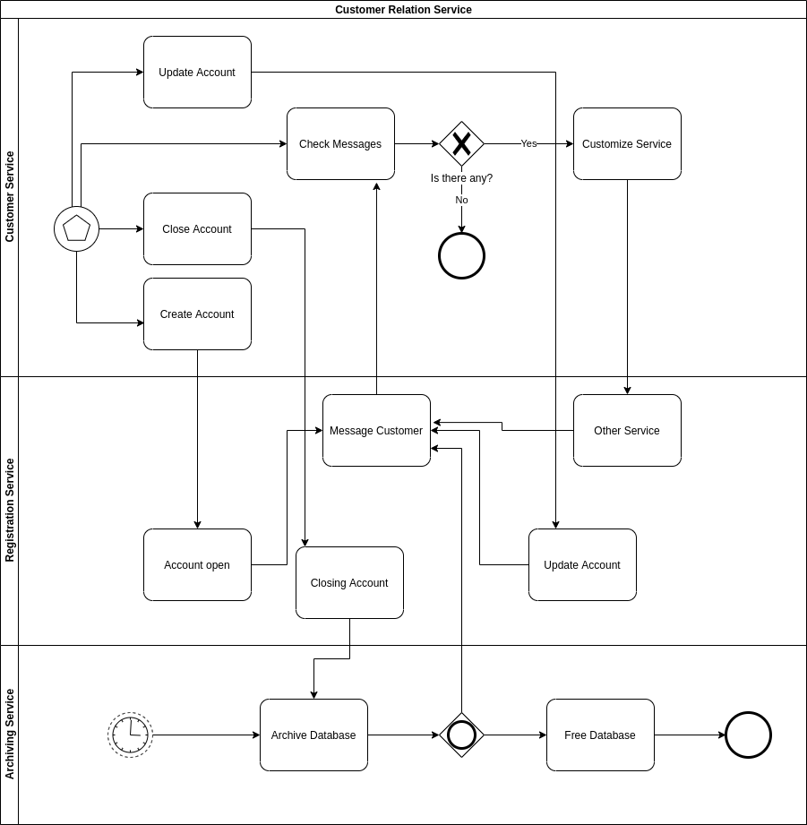
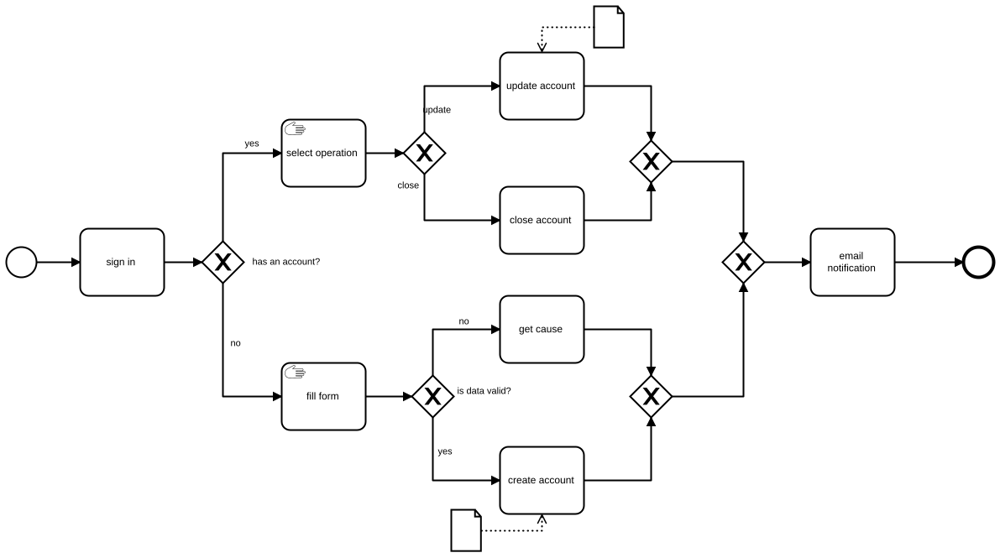

# `Impalink FTGP` | CRS project

Project phase of the Fill the Tech Gap Program. Customer Relation Management Process or CRS is a demonstration project made during the last phase of FTGP.

## Technologies
* Java
* Spring Web
* JPA
* MySQL
* H2 (dev only)
* Rest Repository

## Technical BPMN

## Executable BPMN

## Contributors
- [me](https://github.com/47leonel-wabo)
- [Tchamo Frank](https://github.com/franck2019) 🚀
- [Noutsa William](https://github.com/NC-52) 🔥 SCRUM MASTER ⭐⭐⭐⭐⭐